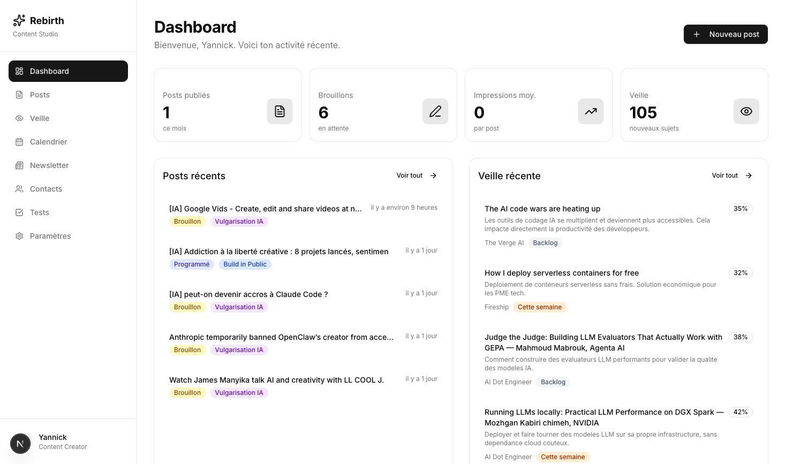
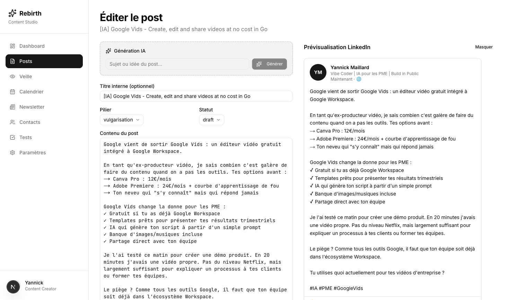
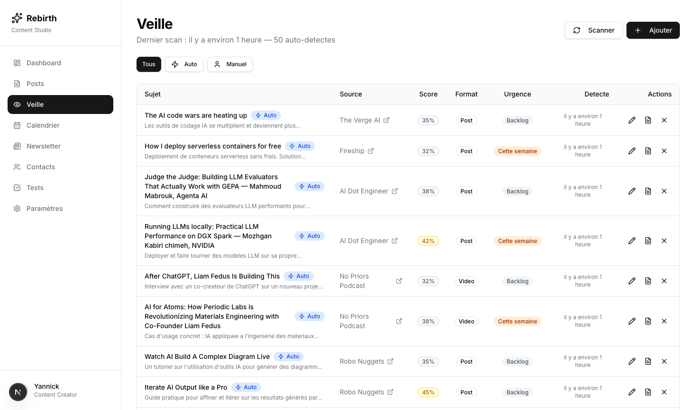
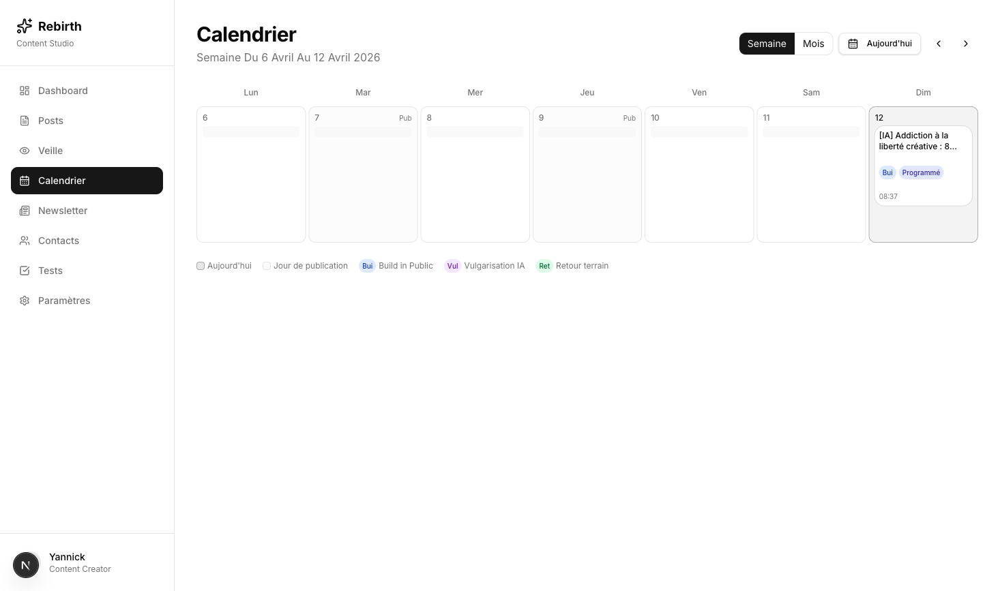
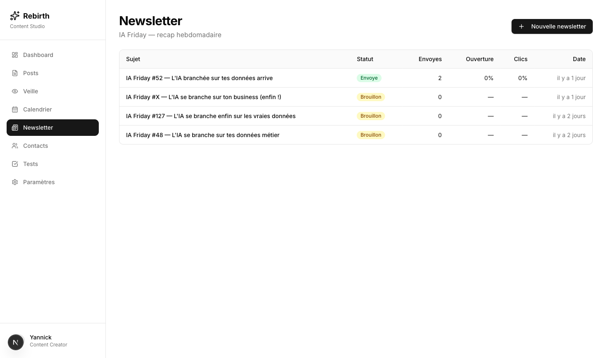

# Rebirth Content Studio

Plateforme de contenu LinkedIn + newsletter **IA Friday** pour la democratisation de l'IA aupres des PME.

## Screenshots

### Dashboard


### Editeur de post + Preview LinkedIn


### Veille automatisee


### Calendrier editorial


### Newsletter IA Friday


## Stack

- **Framework:** Next.js 15+ (App Router) + TypeScript
- **Database:** Supabase (PostgreSQL)
- **UI:** TailwindCSS + shadcn/ui
- **IA:** Anthropic Claude (Sonnet 4)
- **LinkedIn:** LinkedIn API v2 (OAuth 2.0)
- **Newsletter:** Resend + React Email
- **Notifications:** Telegram Bot API
- **MCP:** Model Context Protocol server (SSE transport)
- **Deploiement:** Vercel

## Fonctionnalites

- Creation et edition de posts LinkedIn assistes par IA
- Preview LinkedIn en temps reel
- Systeme de veille automatise (RSS + YouTube, scoring IA)
- Agent Telegram conversationnel (memoire, rappels, images, sources veille)
- Generateur de scripts video face camera
- Newsletter hebdomadaire "IA Friday"
- Calendrier editorial (semaine/mois)
- Programmation de posts avec timezone Montreal
- Analytics LinkedIn

## Setup

```bash
cp .env.local.example .env.local
# Remplir les variables d'environnement
npm install
npm run dev
```

## Commandes

```bash
npm run dev            # Dev server (port 3001)
npm run build          # Build production
npm run lint           # ESLint
```
